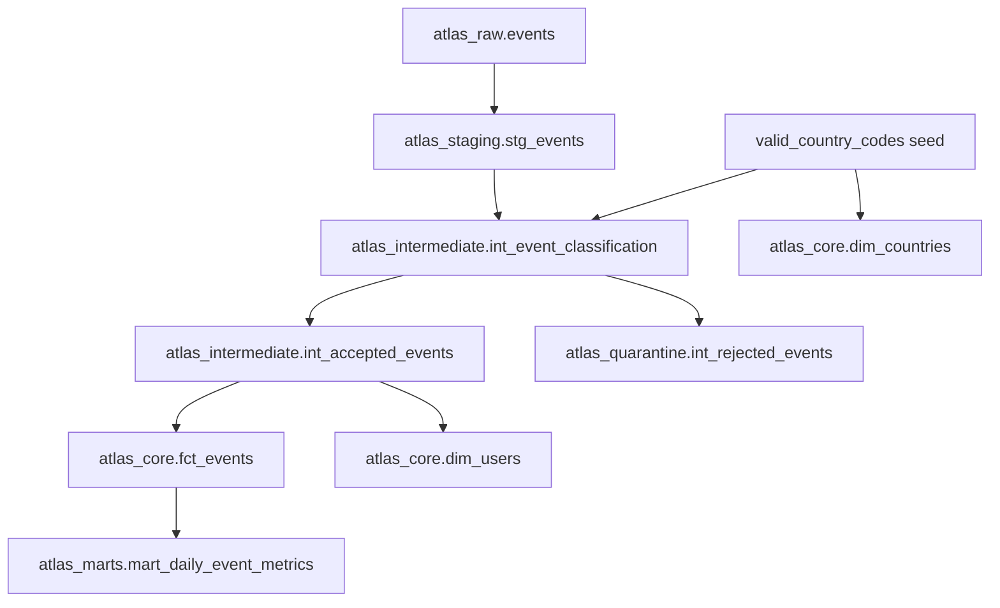

# Project Atlas Sprint 2 Architecture

## Objective

Transform immutable Sprint 1 raw events into a governed BigQuery warehouse with explicit
quality classification, quarantine, trusted facts, and daily marts.

## Layered datasets

| Dataset | Purpose | Representative relations |
| --- | --- | --- |
| `atlas_raw` | Immutable physical landing (Sprint 1) | `events` |
| `atlas_staging` | Normalized views and seeds | `stg_events`, `valid_country_codes` |
| `atlas_intermediate` | Classification and accepted canonical rows | `int_event_classification`, `int_accepted_events` |
| `atlas_quarantine` | Rejected physical rows | `int_rejected_events` |
| `atlas_core` | Dimensions and incremental fact | `dim_users`, `dim_countries`, `fct_events` |
| `atlas_marts` | Analyst-facing aggregates | `mart_daily_event_metrics` |

## Flow

## Classification rules

Terminal rejection precedence per physical row:

1. `missing_user_id`
2. `invalid_country_code`
3. `future_dated`
4. `duplicate_extra`
5. `accepted`

Duplicates rank by `ingested_at DESC, event_timestamp DESC, source_file DESC, raw_record_hash DESC`.
Only rank 1 can be accepted when no higher-precedence defect exists.

## Temporal semantics

See [ADR-003](adr/ADR-003-corrected-temporal-semantics.md). Sprint 1's 300 "late-arriving"
rows are backdated declared dates, not event-time late arrivals.

## Incremental strategy

`fct_events` uses BigQuery merge incremental logic keyed on `event_id`, partitioned by
`event_date`, clustered by `event_name` and `country_code`, with a three-day ingestion
lookback. Optional `start_date` / `end_date` vars support bounded backfills.

## Airflow handoff

Sprint 2 scripts are Cloud Shell–authoritative:

1. `scripts/setup_dbt.sh`
2. `scripts/run_dbt_sprint2.sh`
3. `scripts/validate_dbt_sprint2.sh`

An orchestrator can wrap these commands after Sprint 1 ingestion completes.
