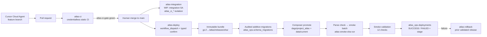

# Atlas Architecture — Sprint 4: Secure Delivery System

## Delivery flow



## Trust boundaries

| Zone | Code executed | Credentials | Writes allowed |
|---|---|---|---|
| PR CI (`atlas-ci`) | untrusted PR code | none (`contents: read`) | GitHub artifacts only |
| Integration (`atlas-integration`) | main-reachable SHAs only | WIF → `atlas-github-integration` | `atlas_ci_*` datasets, CI bucket prefix |
| Deployment (`atlas-deploy`/`atlas-rollback`) | main-reachable SHAs only | WIF → `atlas-github-deployer` | deployment bucket, Composer paths, additive migrations, `atlas_ops` audit |
| Composer runtime | promoted immutable release | `atlas-composer-runtime` env SA | canonical Atlas datasets, events bucket |
| Cursor agent | working tree | project service account (dev env) | development resources |

Key property: **pull requests can never reach GCP.** The WIF provider rejects
non-repo tokens, and impersonation bindings accept only
`YOUR_GITHUB_OWNER/YOUR_REPOSITORY@refs/heads/main` (ADR-009).

## CI workflow graph (`atlas-ci`)

```text
pull_request / push(main) / dispatch  [path-scoped to core Atlas pipeline]
  ├── atlas-security-shell   secret scan, dep sanity, shell syntax+static, workflow YAML
  ├── atlas-python           ruff format+lint, mypy, unit+acceptance tests, config gate
  ├── atlas-dbt              pinned dbt deps + parse (compile/unit tests run in
  │                          the authenticated integration stage — ADR-008)
  ├── atlas-airflow          pinned 3.1.7 + constraints, pip check, DAG import
  │                          (safe_mode=False), structure/retry/parse-safety tests
  └── atlas-ci-gate          single stable required-check name
```

All jobs call `scripts/validate_ci.sh --mode static --group <group>` — the
canonical validation contract shared by agents, developers, CI, and release
tooling. Business logic never lives in workflow YAML (ADR-008).

## Deployment bundle format (ADR-010)

`atlas-bundle.tar.gz` (deterministic tar: sorted names, fixed mtime, gzip -n):

```text
atlas-bundle/
  dags/                      # parse-time assets → <composer>/dags/project_atlas/
  src/atlas/                 # runtime library
  scripts/                   # runtime step scripts only
  config/                    # atlas.yaml, anomaly_profile.yaml
  sql/ + sql/migrations/     # additive DDL + ledger manifest
  dbt/atlas_dbt/             # dbt project (no target/, logs/, packages)
  dbt/profiles/profiles.yml  # keyless oauth runtime profile
  requirements*.txt          # dependency manifests
  release-manifest.json      # git sha/ref/tag, build metadata, tool versions,
                             # per-file SHA-256, required/min schema version
```

Immutable home: `gs://atlas-deployments-…/atlas/releases/<git_sha>/` with
create-only semantics. `data/current/` on the Composer bucket is
always a verified promoted copy; the release path is the rollback source of
truth.

## Composer runtime mapping

| Concern | Path |
|---|---|
| DAG parsing | `<composer-bucket>/dags/project_atlas/` |
| Runtime code+config | `<composer-bucket>/data/current/` (`ATLAS_ROOT`) |
| Batch artifacts + markers | `…/current/data/runs/<batch_id>/` (GCSfuse) |
| dbt writes | `/tmp/dbt-target`, `/tmp/dbt-logs` (worker-local) |
| Deployed identity | `…/current/release-manifest.json` + `deployment-info.json` |

Environment variables set at creation: `ATLAS_ROOT`, `ATLAS_GCP_PROJECT_ID`,
`ATLAS_GCS_BUCKET`, `ATLAS_BQ_DATASET`, `ATLAS_DBT_DATASET`,
`DBT_PROJECT_DIR`, `DBT_PROFILES_DIR`, `DBT_LOCATION`, `DBT_TARGET_PATH`,
`DBT_LOG_PATH`. The deployed git SHA and deployment id are file-based
(promoted with each release) rather than env vars, so promotion never waits on
slow environment-update operations.

## Audit model

- `atlas_ops.pipeline_runs` — one row per DAG execution (Sprint 3 grain).
- `atlas_ops.schema_migrations` — one row per migration, checksummed.
- `atlas_ops.deployments` — one row per deployment/rollback attempt, MERGE
  keyed by `deployment_id`, statuses RUNNING/SUCCESS/FAILED/ROLLING_BACK/
  ROLLED_BACK/ROLLBACK_FAILED, sanitized errors, `previous_git_sha` linkage.

Grains stay separate: a deployment references its smoke run by id only.

## IAM matrix (live, ADR-009)

See ADR-009 for the full table and the documented `bigquery.dataEditor`
project-scope risk with compensating controls. No Owner/Editor/IAM-admin
grants; no service-account keys anywhere in the delivery path.
