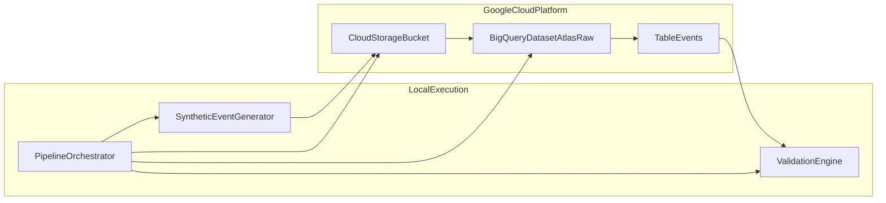
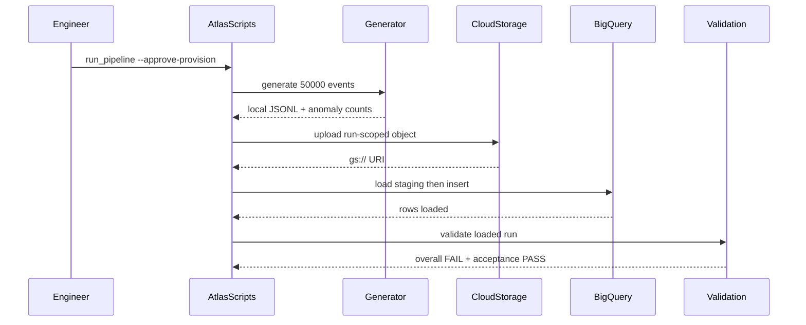

# Project Atlas Architecture — Sprint 1

## Purpose

Sprint 1 establishes a reproducible raw ingestion path that future Atlas versions
can extend with dbt, Airflow, CI/CD, and monitoring without refactoring core
boundaries.

## Component diagram



## Sequence diagram



## Data flow

1. Generator writes deterministic JSONL locally.
2. Upload writes `raw/event_date=YYYY-MM-DD/run_id=<id>/events.jsonl`.
3. Loader creates dataset/table if missing, loads staging, inserts enriched rows.
4. Validation queries loaded rows and reports PASS/FAIL checks.

## Repository diagram

```text

├── config/atlas.yaml              Shared runtime settings
├── config/anomaly_profile.yaml    Seeded anomaly expectations
├── src/atlas/generator/           Synthetic event generation
├── src/atlas/ingestion/           GCS upload
├── src/atlas/loader/              BigQuery load
├── src/atlas/validation/          Quality checks
├── src/atlas/pipeline/            Orchestration only
├── scripts/                       Cloud Shell entry points
├── sql/create_events_table.sql    Raw table DDL
└── tests/                         Automated verification
```

## Key design decisions

| Decision | Why | Tradeoff | Future impact |
| --- | --- | --- | --- |
| Nested project in `de-project-1` | Preserves workspace-root MCP config | Two Python packaging contexts | Airflow/dbt can reference Atlas paths directly in v0.3/v0.4 |
| Run-scoped GCS keys | Prevents overwrite while keeping date partitions | Slightly longer object paths | Compatible with future partition-aware backfills |
| Staging-table load | Idempotent replays and explicit metadata enrichment | Extra transient table per run | Maps cleanly to dbt staging models |
| Overall validation FAIL on seeded anomalies | Mirrors real data-quality posture | Requires separate acceptance checks | dbt tests can reuse anomaly expectations in v0.3 |

## Failure handling

- Duplicate upload: existing object detected, upload marked `already_exists`.
- Missing file: step fails before cloud mutation.
- Bad schema: BigQuery load job fails and pipeline stops.
- Duplicate run load: target-table run guard skips re-insert.
- Partial load: staging table deleted after successful insert; failed insert leaves no target rows for run id.

## Out of scope

Sprint 1 intentionally excludes dbt models, Airflow DAGs, Terraform, Pub/Sub,
streaming, dashboards, CI/CD, and alerting.
