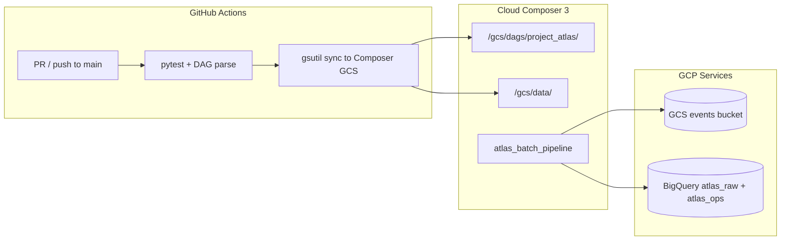

# Sprint 4 Plan — Production Deployment & Operations

**Yes, you're ready to start Sprint 4.** Sprint 3 is merged, tagged (`atlas-sprint-3-complete`), and live-validated. The natural next step is moving from **local Airflow** to **managed Cloud Composer** with CI/CD — exactly what the Sprint 3 incident report deferred.

---

## Readiness gate

| Prerequisite | Status |
|---|---|
| Sprint 3 merged to `main` | Done (`8aa1d7a`) |
| Tag `atlas-sprint-3-complete` | Done |
| Live acceptance (5 scenarios) | Done — all PASS |
| Static tests (47/47) | Done |
| Composer path contract documented | Done (ADR-005, preflight) |
| Composer environment exists | **Not started** |
| CI/CD for DAG deploy | **Not started** |
| Monitoring / alerting | **Not started** |

**Verdict:** Green to begin Sprint 4. No blocking debt from Sprint 3.

---

## Sprint 4 theme

> **Deploy Atlas to Cloud Composer with automated CI/CD, observability, and a promotion checklist.**

Sprints 1–3 built the pipeline. Sprint 4 makes it **operable in production**.

The Artifact Platform is a parallel capability (already has its own Terraform + runbook). Sprint 4 focuses on the **batch ELT pipeline**, not artifact hosting — unless you explicitly want to unify them.

---

## Architecture target



---

## Workstreams

### 1. Composer infrastructure (Terraform)


- Composer 3 environment on image `composer-3-airflow-3.1.7-build.12` (ADR-005)
- Dedicated service account with least-privilege IAM (BigQuery, GCS, Composer worker)
- Environment variables: `ATLAS_ROOT`, `ATLAS_GCP_PROJECT_ID`, `DBT_PROFILES_DIR`
- PyPI packages from `requirements-airflow.txt` via Composer `pypi_packages`
- GCS bucket layout for DAGs vs. runtime data (per preflight contract)

**Deliverables:** Terraform modules, `terraform.tfvars.example`, bootstrap script gated by `ATLAS_APPROVE_PROVISION=true`

---

### 2. CI/CD pipeline (GitHub Actions)

No `.github/workflows/` exist today. Add:

| Workflow | Trigger | Steps |
|---|---|---|
| `atlas-test.yml` | PR + push to `main` | `pytest tests/`, `bash -n scripts/*.sh`, DAG import/parse tests |
| `atlas-deploy-composer.yml` | Push to `main` (post-merge) | Sync DAGs → `/gcs/dags/project_atlas/`, sync scripts+dbt → `/gcs/data/` |

**Key constraints:**

- Deploy only changed paths (DAGs vs. data separately, per runbook-sprint3)
- Use Workload Identity Federation or a GitHub secret for GCP auth (no SA keys in repo)
- Fail deploy if `pip check` or DAG parse fails post-sync

---

### 3. Composer promotion checklist & runbook

Formalize what Sprint 3 left as notes:

- **Dev → staging → prod** promotion steps (or single-env for personal project)
- Pre-deploy: version pin verification, ADR-005 image availability
- Post-deploy: trigger smoke run (`atlas-$(date +%Y%m%d)`), verify audit row in `atlas_ops.pipeline_runs`
- Rollback: re-sync previous tag's GCS contents

**Deliverables:** `docs/runbook-sprint4.md`, `docs/promotion-checklist-sprint4.md`, ADR-008 (Composer deployment topology)

---

### 4. Observability & alerting

Leverage existing `atlas_ops.pipeline_runs` audit table:

- Cloud Monitoring alert: pipeline run `FAILED` status within 15 min
- Optional: log-based metric from Airflow task failure logs
- Dashboard: batch success rate, rows loaded/accepted/rejected over time
- Wire into existing `write_run_summary` finalizer output

**Deliverables:** Terraform alerting resources, `docs/monitoring-sprint4.md`

---

### 5. Composer acceptance matrix

Re-run Sprint 3's 5 scenarios against **Composer** (not local Airflow):

1. Retry success (`upload_once`)
2. Idempotent rerun
3. dbt failure injection
4. Historical recovery
5. Fresh historical batch

**Deliverables:** `docs/validation-report-sprint4.md` with Composer-specific evidence

---

## Definition of done

- [ ] Composer 3 environment provisioned via Terraform (approval-gated)
- [ ] GitHub Actions: test on PR, deploy on merge
- [ ] DAG + data assets synced to Composer GCS paths
- [ ] Smoke run succeeds; audit row `SUCCESS` in `atlas_ops.pipeline_runs`
- [ ] All 5 acceptance scenarios pass on Composer
- [ ] Alert fires on injected failure (scenario 3)
- [ ] Promotion checklist documented and executed once
- [ ] Tag `atlas-sprint-4-complete`

---

## Risks & mitigations

| Risk | Mitigation |
|---|---|
| Python 3.12 (local) vs 3.11.8 (Composer) | Existing parse-safety tests; add Composer smoke in CI |
| Composer image retired | ADR-005 documents pin; add image availability check to deploy workflow |
| GCP cost (Composer ~$300+/mo) | Use smallest env size; document teardown script |
| GitHub → GCP auth | WIF preferred; fallback to Cursor secret pattern already used |
| dbt profiles on Composer | Mount via GCS data path + `DBT_PROFILES_DIR` env var |

---

## Suggested implementation order

```
Phase A — Foundation (can start immediately)
  ├── ADR-008: Composer deployment topology
  ├── Terraform: Composer environment module
  └── Manual first deploy script (deploy_composer.sh)

Phase B — Automation
  ├── GitHub Actions: atlas-test.yml
  ├── GitHub Actions: atlas-deploy-composer.yml
  └── Promotion checklist doc

Phase C — Validation & ops
  ├── Composer acceptance matrix (5 scenarios)
  ├── Monitoring alerts + dashboard
  └── validation-report-sprint4.md + tag
```

---

## Open decisions (need your input)

1. **Single Composer env or dev+prod?** For a personal sandbox, one env is fine. Say if you want two.
2. **Scheduled vs. manual-only?** Sprint 3 DAG is manual-triggered. Sprint 4 could add a daily schedule — or keep manual until you're confident.
3. **Artifact Platform in scope?** It's deployable separately today. Include in Sprint 4 only if you want a unified "Atlas platform" release.
4. **GitHub Actions auth:** Workload Identity Federation (cleaner) vs. service account key secret (simpler, matches existing Cursor pattern)?

---

## Recommendation

Start Sprint 4 with **Phase A** — Terraform + manual deploy script + one Composer smoke run. That validates the hardest part (infra + path mapping) before wiring CI/CD.

If this scope looks right, proceed with branch `cursor/atlas-sprint-4-composer-deploy-64a2`, ADR-008, and the Terraform scaffold. If you had a different Sprint 4 in mind (e.g. streaming, DEOS integration, data quality SLAs), reshape the plan accordingly.
